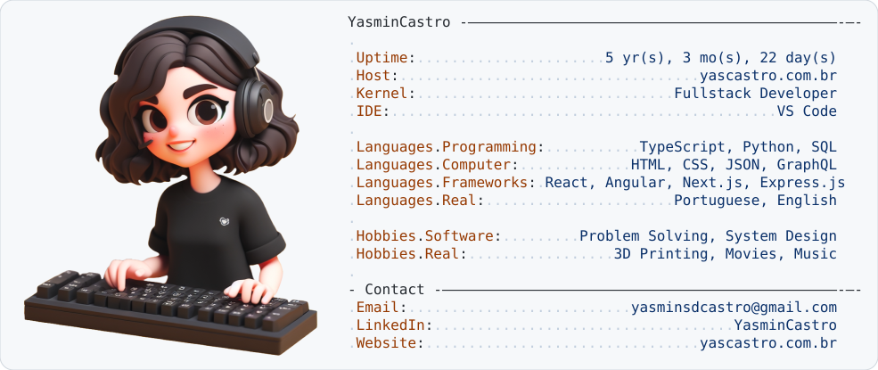
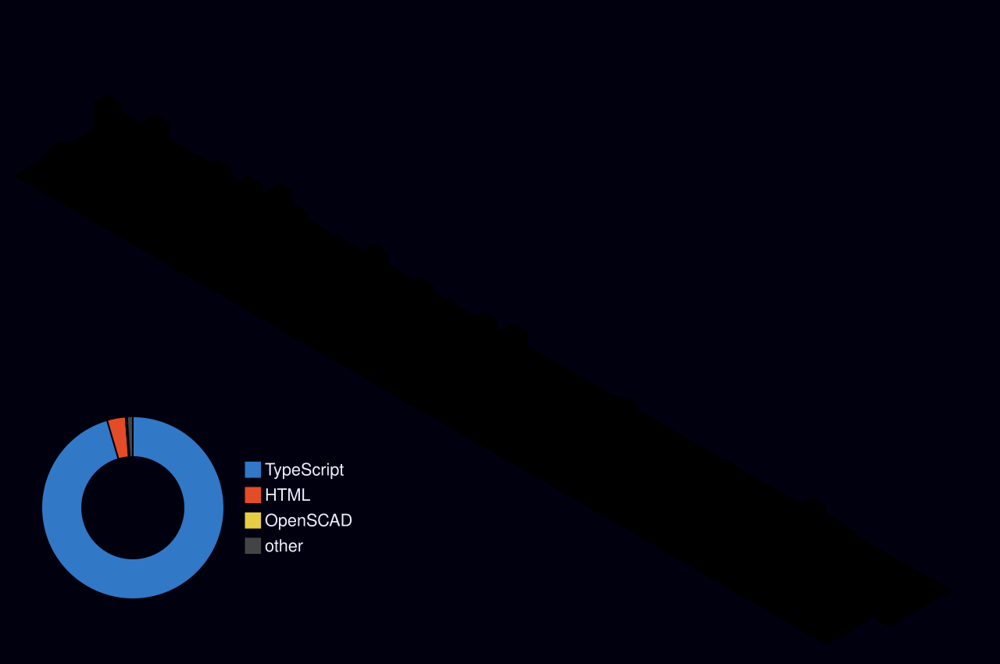

  <picture>
    <source media="(prefers-color-scheme: dark)" srcset="id_badge_dark.svg">
    <source media="(prefers-color-scheme: light)" srcset="id_badge_light.svg">
    
  </picture>

 
   
  <a href = "mailto:yasminsdcastro@gmail.com"><a>
   

## 🚀 About Me

I enjoy building products that turn raw data into decisions people can actually act on.

<!-- PROJECTS:START --> 🔭 I'm currently working on <a href="https://github.com/YasminCastro/yastech-status">yastech-status</a> and <a href="https://github.com/YasminCastro/jobhunter-ts">jobhunter-ts</a>. <!-- PROJECTS:END -->

🌱 I'm constantly learning about scalable backend architecture and AI/computer vision integrations.

**🛠️ Tech Stack**

 

## 🏙️ My GitHub City

  

